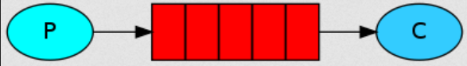
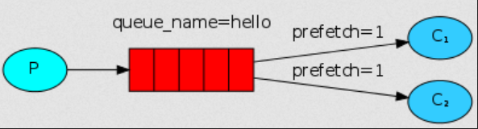
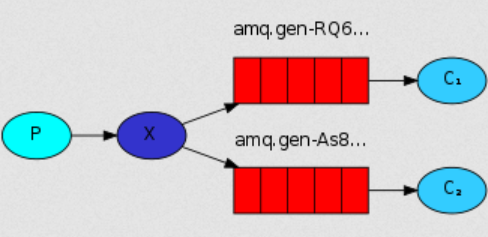
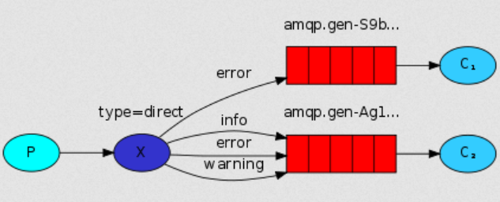
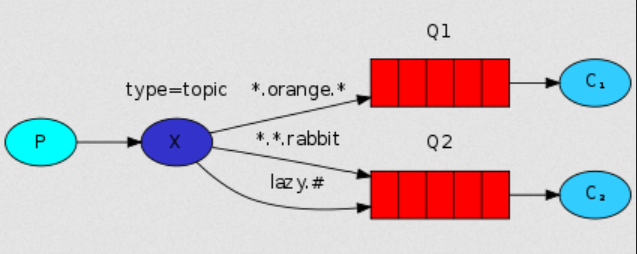

# 20200818 开始学习RabbitMQ
## 简单模式-simple



消息发布者：send.php

```php
<?php
require_once __DIR__ . '/../vendor/autoload.php';
use PhpAmqpLib\Connection\AMQPStreamConnection;
use PhpAmqpLib\Message\AMQPMessage;
$connection = new AMQPStreamConnection('localhost', 5672, 'guest', 'guest');
$channel = $connection->channel();

$channel->queue_declare('hello', false, false, false, false);

$stime = microtime(true);
echo $stime."\n";
$message = '简单模式--'.$stime;
$msg = new AMQPMessage($message);
$channel->basic_publish($msg, '', 'hello');

echo " [x] Sent '简单模式'\n";

$channel->close();
$connection->close();
```

消息接收者：

```php
<?php
require_once __DIR__ . '/../vendor/autoload.php';
use PhpAmqpLib\Connection\AMQPStreamConnection;
$connection = new AMQPStreamConnection('localhost', 5672, 'guest', 'guest');
$channel = $connection->channel();
$channel->queue_declare('hello', false, false, false, false);

echo " [*] Waiting for messages. To exit press CTRL+C\n";

$callback = function ($msg) {
    echo ' [x] Received ', $msg->body, "\n";
};

$channel->basic_consume('hello', '', false, true, false, false, $callback);

while ($channel->is_consuming()) {
    $channel->wait();
}
```

## 工作模式-work



消息发布者：new_task.php

```php
<?php

require_once __DIR__ . '/../vendor/autoload.php';
use PhpAmqpLib\Connection\AMQPStreamConnection;
use PhpAmqpLib\Message\AMQPMessage;

$connection = new AMQPStreamConnection('localhost', 5672, 'guest', 'guest');
$channel = $connection->channel();

$channel->queue_declare('task_queue', false, true, false, false);

$data = implode(' ', array_slice($argv, 1));
if (empty($data)) {
    $data = "Hello World!";
}
$msg = new AMQPMessage(
    $data,
    array('delivery_mode' => AMQPMessage::DELIVERY_MODE_PERSISTENT)
);

$channel->basic_publish($msg, '', 'task_queue');

echo ' [x] Sent ', $data, "\n";

$channel->close();
$connection->close();
```

消息接收者：worker.php

```php
<?php

require_once __DIR__ . '/../vendor/autoload.php';
use PhpAmqpLib\Connection\AMQPStreamConnection;

$connection = new AMQPStreamConnection('localhost', 5672, 'guest', 'guest');
$channel = $connection->channel();

$channel->queue_declare('task_queue', false, true, false, false);

echo " [*] Waiting for messages. To exit press CTRL+C\n";

$callback = function ($msg) {
    echo ' [x] Received ', $msg->body, "\n";
    sleep(substr_count($msg->body, '.'));
    echo " [x] Done\n";
    $msg->delivery_info['channel']->basic_ack($msg->delivery_info['delivery_tag']);
};

$channel->basic_qos(null, 1, null);
$channel->basic_consume('task_queue', '', false, false, false, false, $callback);

while ($channel->is_consuming()) {
    $channel->wait();
}

$channel->close();
$connection->close();
```

打开多个命令行执行命令：

```shell
# shell 1
php new_task.php First message.
php new_task.php Second message..
php new_task.php Third message...
php new_task.php Fourth message....
php new_task.php Fifth message.....
    
# shell 2
php worker.php
# => [*] Waiting for messages. To exit press CTRL+C
    
# shell 2
php worker.php
# => [*] Waiting for messages. To exit press CTRL+C
# => [x] Received 'Second message..'
# => [x] Received 'Fourth message....'
```

##  发布/订阅(pub/sub)模式 -fanout



消息发布者：emit_log.php

``` php
<?php

require_once __DIR__ . '/../vendor/autoload.php';
use PhpAmqpLib\Connection\AMQPStreamConnection;
use PhpAmqpLib\Message\AMQPMessage;

$connection = new AMQPStreamConnection('localhost', 5672, 'guest', 'guest');
$channel = $connection->channel();

$channel->exchange_declare('logs', 'fanout', false, false, false);

$data = implode(' ', array_slice($argv, 1));
if (empty($data)) {
    $data = "info: 订阅模式";
}
$msg = new AMQPMessage($data);

$channel->basic_publish($msg, 'logs');

echo ' [x] Sent ', $data, "\n";

$channel->close();
$connection->close();
```

消息订阅者：receive_logs.php

```php
<?php

require_once __DIR__ . '/../vendor/autoload.php';
use PhpAmqpLib\Connection\AMQPStreamConnection;

$connection = new AMQPStreamConnection('localhost', 5672, 'guest', 'guest');
$channel = $connection->channel();

$channel->exchange_declare('logs', 'fanout', false, false, false);

list($queue_name, ,) = $channel->queue_declare("", false, false, true, false);

$channel->queue_bind($queue_name, 'logs');

echo " [*] Waiting for logs. To exit press CTRL+C\n";

$callback = function ($msg) {
    echo ' [x] ', $msg->body, "\n";
};

$channel->basic_consume($queue_name, '', false, true, false, false, $callback);

while ($channel->is_consuming()) {
    $channel->wait();
}

$channel->close();
$connection->close();
```

命令框执行：

```shell
#若要把消息记录到日志里，执行下面的命令
php receive_logs.php > logs_from_rabbit.log
#若要把消息直接展示到命令框内，执行下面的命令
#订阅者
php receive_logs.php
#消息发布者
php emit_log.php
```

##  路由模式 -routing



发布消息： emit_log_direct.php 

```php
<?php

require_once __DIR__ . '/../vendor/autoload.php';
use PhpAmqpLib\Connection\AMQPStreamConnection;
use PhpAmqpLib\Message\AMQPMessage;

$connection = new AMQPStreamConnection('localhost', 5672, 'guest', 'guest');
$channel = $connection->channel();

$channel->exchange_declare('direct_logs', 'direct', false, false, false);

$severity = isset($argv[1]) && !empty($argv[1]) ? $argv[1] : 'info';

$data = implode(' ', array_slice($argv, 2));
if (empty($data)) {
    $data = "路由(routing)模式";
}

$msg = new AMQPMessage($data);

$channel->basic_publish($msg, 'direct_logs', $severity);

echo ' [x] Sent ', $severity, ':', $data, "\n";

$channel->close();
$connection->close();
```

消息接收： receive_logs_direct.php 

```php
<?php

require_once __DIR__ . '/../vendor/autoload.php';
use PhpAmqpLib\Connection\AMQPStreamConnection;

$connection = new AMQPStreamConnection('localhost', 5672, 'guest', 'guest');
$channel = $connection->channel();

$channel->exchange_declare('direct_logs', 'direct', false, false, false);

list($queue_name, ,) = $channel->queue_declare("", false, false, true, false);

$severities = array_slice($argv, 1);
if (empty($severities)) {
    file_put_contents('php://stderr', "Usage: $argv[0] [info] [warning] [error]\n");
    exit(1);
}

foreach ($severities as $severity) {
    $channel->queue_bind($queue_name, 'direct_logs', $severity);
}

echo " [*] Waiting for logs. To exit press CTRL+C\n";

$callback = function ($msg) {
    echo ' [x] ', $msg->delivery_info['routing_key'], ':', $msg->body, "\n";
};

$channel->basic_consume($queue_name, '', false, true, false, false, $callback);

while ($channel->is_consuming()) {
    $channel->wait();
}

$channel->close();
$connection->close();
```

命令框执行：

```shell
#如果你想只保存'warning'和'error'(而不是'info')日志消息到一个文件，只需打开控制台并输入:
php receive_logs_direct.php warning error > logs_from_rabbit.log
#如果你想在你的屏幕上看到所有的日志消息，打开一个新的终端并做:
php receive_logs_direct.php info warning error
#发出一个错误日志消息，只需输入:
php emit_log_direct.php error "Run. Run. Or it will explode."
```

##  主题模式 -topic



发布消息： emit_log_topic.php 

``` php
<?php

require_once __DIR__ . '/../vendor/autoload.php';
use PhpAmqpLib\Connection\AMQPStreamConnection;
use PhpAmqpLib\Message\AMQPMessage;

$connection = new AMQPStreamConnection('localhost', 5672, 'guest', 'guest');
$channel = $connection->channel();

$channel->exchange_declare('topic_logs', 'topic', false, false, false);

$routing_key = isset($argv[1]) && !empty($argv[1]) ? $argv[1] : 'anonymous.info';
$data = implode(' ', array_slice($argv, 2));
if (empty($data)) {
    $data = "Hello World!";
}

$msg = new AMQPMessage($data);

$channel->basic_publish($msg, 'topic_logs', $routing_key);

echo ' [x] Sent ', $routing_key, ':', $data, "\n";

$channel->close();
$connection->close();
```

接收消息： receive_logs_topic.php

```php
<?php

require_once __DIR__ . '/../vendor/autoload.php';
use PhpAmqpLib\Connection\AMQPStreamConnection;

$connection = new AMQPStreamConnection('localhost', 5672, 'guest', 'guest');
$channel = $connection->channel();

$channel->exchange_declare('topic_logs', 'topic', false, false, false);

list($queue_name, ,) = $channel->queue_declare("", false, false, true, false);

$binding_keys = array_slice($argv, 1);
if (empty($binding_keys)) {
    file_put_contents('php://stderr', "Usage: $argv[0] [binding_key]\n");
    exit(1);
}

foreach ($binding_keys as $binding_key) {
    $channel->queue_bind($queue_name, 'topic_logs', $binding_key);
}

echo " [*] Waiting for logs. To exit press CTRL+C\n";

$callback = function ($msg) {
    echo ' [x] ', $msg->delivery_info['routing_key'], ':', $msg->body, "\n";
};

$channel->basic_consume($queue_name, '', false, true, false, false, $callback);

while ($channel->is_consuming()) {
    $channel->wait();
}

$channel->close();
$connection->close();
```

命令框执行：

```shell
#接收所有日志
php receive_logs_topic.php "#"
#获取匹配“kern.*”的数据
php receive_logs_topic.php "kern.*"
#获取匹配“*.critical”的数据
php receive_logs_topic.php "*.critical"
#获取匹配上述两种数据
php receive_logs_topic.php "kern.*" "*.critical"
#发布消息
php emit_log_topic.php "kern.critical" "A critical kernel error"
```

## RPC

Remote Procedure Call：远程过程调用，一次远程过程调用的流程即客户端发送一个请求到服务端，服务端根据请求信息进行处理后返回响应信息，客户端收到响应信息后结束。


server：rpc_server.php

```php
<?php

require_once __DIR__ . '/../vendor/autoload.php';
use PhpAmqpLib\Connection\AMQPStreamConnection;
use PhpAmqpLib\Message\AMQPMessage;

$connection = new AMQPStreamConnection('localhost', 5672, 'guest', 'guest');
$channel = $connection->channel();

$channel->queue_declare('rpc_queue', false, false, false, false);

function fib($n)
{
    if ($n == 0) {
        return 0;
    }
    if ($n == 1) {
        return 1;
    }
    return fib($n-1) + fib($n-2);
}

echo " [x] Awaiting RPC requests\n";
$callback = function ($req) {
    $n = intval($req->body);
    echo ' [.] fib(', $n, ")\n";

    $msg = new AMQPMessage(
        (string) fib($n),
        array('correlation_id' => $req->get('correlation_id'))
    );

    $req->delivery_info['channel']->basic_publish(
        $msg,
        '',
        $req->get('reply_to')
    );
    $req->delivery_info['channel']->basic_ack(
        $req->delivery_info['delivery_tag']
    );
};

$channel->basic_qos(null, 1, null);
$channel->basic_consume('rpc_queue', '', false, false, false, false, $callback);

while ($channel->is_consuming()) {
    $channel->wait();
}

$channel->close();
$connection->close();
```

client：rpc_client.php

```php
<?php

require_once __DIR__ . '/../vendor/autoload.php';
use PhpAmqpLib\Connection\AMQPStreamConnection;
use PhpAmqpLib\Message\AMQPMessage;

class FibonacciRpcClient
{
    private $connection;
    private $channel;
    private $callback_queue;
    private $response;
    private $corr_id;

    public function __construct()
    {
        $this->connection = new AMQPStreamConnection(
            'localhost',
            5672,
            'guest',
            'guest'
        );
        $this->channel = $this->connection->channel();
        list($this->callback_queue, ,) = $this->channel->queue_declare(
            "",
            false,
            false,
            true,
            false
        );
        $this->channel->basic_consume(
            $this->callback_queue,
            '',
            false,
            true,
            false,
            false,
            array(
                $this,
                'onResponse'
            )
        );
    }

    public function onResponse($rep)
    {
        if ($rep->get('correlation_id') == $this->corr_id) {
            $this->response = $rep->body;
        }
    }

    public function call($n)
    {
        $this->response = null;
        $this->corr_id = uniqid();

        $msg = new AMQPMessage(
            (string) $n,
            array(
                'correlation_id' => $this->corr_id,
                'reply_to' => $this->callback_queue
            )
        );
        $this->channel->basic_publish($msg, '', 'rpc_queue');
        while (!$this->response) {
            $this->channel->wait();
        }
        return intval($this->response);
    }
}

$fibonacci_rpc = new FibonacciRpcClient();
$response = $fibonacci_rpc->call(30);
echo ' [.] Got ', $response, "\n";
```

